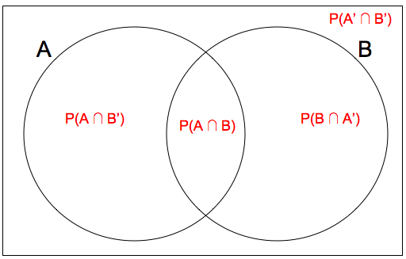

## Introduction to Probability

Many of the concepts that we touch upon in the course contain a certain degree of randomness. Probability is a tool that we can use to analyze these random phenomena.

Let's say we have a random experiment where we toss two coins. The **sample space** $\Omega$ consists of all the possible outcomes of an experiment. In this experiment, our sample space consists of the outcomes: $\Omega = \{HH, HT, TH, TT\}$.

An **event** is any subset of the sample space, to which a probability can be assigned. For example, "getting one tails and one heads" would be an event for the coin toss experiment mentioned above. The outcomes that make up the event are $\{HT, TH\}$ and the probability of this event occuring is $\frac{1}{2}$.

## Probability of Events

Let us consider a sample space where **every outcome is equally likely to occur**. Then, the probability of an event occurring can be calculated as the ratio of the number of outcomes in the event to the total number of events in the sample space. $ \mathbb{P}(\text{an event happens}) = \frac{\text{# of outcomes that make the event happen}}{\text{# of total outcomes}} $
In the coin toss experiment, the events $\{HH, HT, TH, TT\}$ are all equally likely to occur, so to calculate the probability of getting one tails and one heads, we can count the number of outcomes in the event (2) and divide by the total number of outcomes (4) = $ \frac{2}{4} = \frac{1}{2} $

There are a few important properties of probabilities of events:

1. The probability of an event is between 0 and 1: $0 \leq \mathbb{P}(E) \leq 1$
2. The probabilities of all the outcomes in a sample space sum to 1: $\sum_{A \in \Omega} \mathbb{P}(A) = 1$

## Addition Rule
Sometimes, we want to calculate the probabilities involving one event OR another event occuring. To do so, we add their probabilities.

When two events $A$ and $B$ are disjoint (they don't share any common outcomes), then the probability that events $A$ or $B$ ($A \cup B$) occur is the sum of the probability of each event. $\mathbb{P}(A \cup B) = \mathbb{P}(A) + \mathbb{P}(B) \text{ if } A \cap B = \varnothing$. For instance, the events "getting two heads" and "getting two tails" with two coin tosses are disjoint. Therefore, the probability of the combined event "getting two heads or two tails" is equal to the sum of the individual events. $\mathbb{P}(\text{getting two heads or two tails}) = \mathbb{P}(\text{getting two heads}) + \mathbb{P}(\text{getting two tails}) = \frac{1}{4} + \frac{1}{4} = \frac{1}{2}$

When two events $A$ and $B$ aren't disjoint (they share common outcomes), then the probability that $A$ or $B$ ($A \cup B$) occur is the sum of the probability of each event, minus the probability of both events occurring ($A \cap B$). $\mathbb{P}(A \cup B) = \mathbb{P}(A) + \mathbb{P}(B) - \mathbb{P}(A \cap B) \text{ if } A \cap B \neq \varnothing$. The intuition behind this can better be visualized through a venn diagram.

When we have two events $A$ and $B$ that have common outcomes and we want to find the probability that either event happens, we want the area inside the circles. However, if we add together the probabilities of $A$ occurring and $B$ occurring, we count the intersection of the circles, $ \mathbb{P}(A \cap B) $, twice. That's why we need so subtract the intersection once.

For example, let's say we wish to find the probability of the events "getting two heads" or "getting at least 1 head" in two coin tosses. We can see that there are 3 outcomes in our sample space that have at least one head, and 1 outcome that has two heads. If we were to add these probabilites together, we would have $ \frac{3}{4} + \frac{1}{4} = 1$ ! Clearly, this result is wrong because we could get two tails, which isn't an outcome in either event. We did not account for the fact that the two events share an outcome; getting $ \{HH\} $ falls under both events, so we need to subtract the probability of that occuring. The correct probability of both events occuring would be $ \frac{3}{4} + \frac{1}{4} - \frac{1}{4} = \frac{3}{4} $

## Multiplication Rule

Other times, we wish to calculate probabilities involving one event AND another event occurring. To do so, we multiply their probabilities.

In some cases, the first event happening does not impact the probability of the second event happening. We call these **independent events**. Suppose we want to calculated the probability of getting heads on a fair coin toss and getting a six on a fair dice roll. We can take into account that getting heads on a coin toss doesn't have any effect on the result of rolling the dice together. $ \frac{1}{2} $ the time we will get heads, and in that fraction of the time, we will only get a six $ \frac{1}{6} $ of the time. To find a fraction of a fraction, we can multiply them together. $\mathbb{P}(\text{getting heads and a 6}) = \frac{1}{2} * \frac{1}{6} = \frac{1}{12}$. In general for independent events *A* and *B*, $\mathbb{P}(A \text{ and } B) = \mathbb{P}(A)*\mathbb{P}(B)$

In other cases, the first event happening does impact the probability of the second event happening. We call these **dependent events**. For example, let's say we had a bag of 10 marble, 5 blue marbles and 5 red marbles. Consider the event of picking two marbles out of the bag, without replacement. This means we are picking the first marble, leaving it out of the bag, then picking the second. What is the probability that both marbles are blue? Half the marbles are blue at first, so the probability of the first marble being blue is $ \frac{5}{10} $. However, the probability of getting a blue marble changed, because the number of blue marbles and the total number of marbles both decreased by 1. The second time, there is only a $ \frac{4}{9} $ chance of picking a blue marble. Therefore, the probability that both marbles are blue is $ \frac{5}{10} * \frac{4}{9} = \frac{2}{9} $.

## General Multiplication Rule and Conditional Probability
$ \mathbb{P}(A \text{ and } B) = \mathbb{P}(A) * \mathbb{P}(B|A) $
