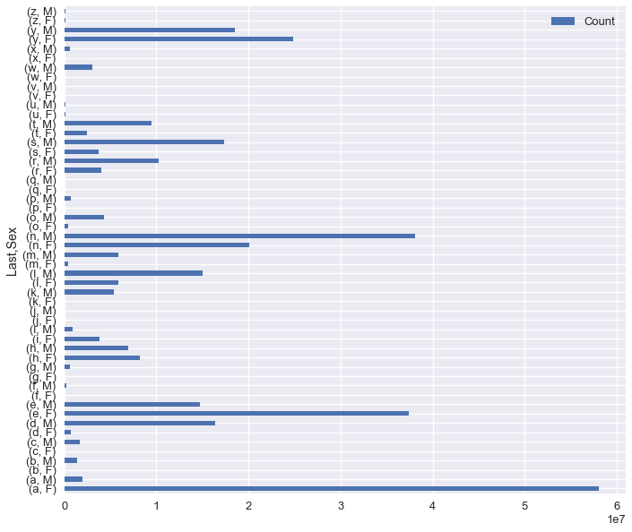
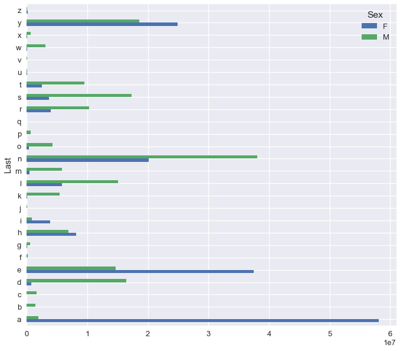
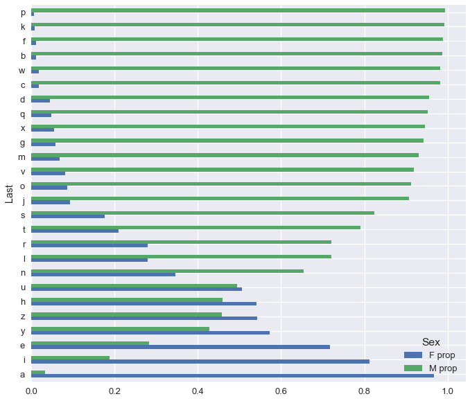

```python
# HIDDEN
import warnings
# Ignore numpy dtype warnings. These warnings are caused by an interaction
# between numpy and Cython and can be safely ignored.
# Reference: https://stackoverflow.com/a/40846742
warnings.filterwarnings("ignore", message="numpy.dtype size changed")
warnings.filterwarnings("ignore", message="numpy.ufunc size changed")

import numpy as np
import matplotlib.pyplot as plt
import pandas as pd
import seaborn as sns
%matplotlib inline
import ipywidgets as widgets
from ipywidgets import interact, interactive, fixed, interact_manual
import nbinteract as nbi

sns.set()
sns.set_context('talk')
np.set_printoptions(threshold=20, precision=2, suppress=True)
pd.options.display.max_rows = 7
pd.options.display.max_columns = 8
pd.set_option('precision', 2)
# This option stops scientific notation for pandas
# pd.set_option('display.float_format', '{:.2f}'.format)
```

## Apply, Strings, and Plotting

In this section, we will answer the question:

**Can we use the last letter of a name to predict the sex of the baby?**

Here's the Baby Names dataset once again:


```python
baby = pd.read_csv('babynames.csv')
baby.head()
# the .head() method outputs the first five rows of the DataFrame
```


<div>
<style>
    .dataframe thead tr:only-child th {
        text-align: right;
    }

    .dataframe thead th {
        text-align: left;
    }

    .dataframe tbody tr th {
        vertical-align: top;
    }
</style>
<table border="1" class="dataframe">
  <thead>
    <tr style="text-align: right;">
      <th></th>
      <th>Name</th>
      <th>Sex</th>
      <th>Count</th>
      <th>Year</th>
    </tr>
  </thead>
  <tbody>
    <tr>
      <th>0</th>
      <td>Mary</td>
      <td>F</td>
      <td>9217</td>
      <td>1884</td>
    </tr>
    <tr>
      <th>1</th>
      <td>Anna</td>
      <td>F</td>
      <td>3860</td>
      <td>1884</td>
    </tr>
    <tr>
      <th>2</th>
      <td>Emma</td>
      <td>F</td>
      <td>2587</td>
      <td>1884</td>
    </tr>
    <tr>
      <th>3</th>
      <td>Elizabeth</td>
      <td>F</td>
      <td>2549</td>
      <td>1884</td>
    </tr>
    <tr>
      <th>4</th>
      <td>Minnie</td>
      <td>F</td>
      <td>2243</td>
      <td>1884</td>
    </tr>
  </tbody>
</table>
</div>


### Breaking the Problem Down

Although there are many ways to see whether prediction is possible, we will use plotting in this section. We can decompose this question into two steps:

1. Compute the last letter of each name.
1. Group by the last letter and sex, aggregating on Count.
1. Plot the counts for each sex and letter.

### Apply

`pandas` Series contain an `.apply()` method that takes in a function and applies it to each value in the Series.


```python
names = baby['Name']
names.apply(len)
```


    0          4
    1          4
    2          4
              ..
    1891891    5
    1891892    6
    1891893    8
    Name: Name, Length: 1891894, dtype: int64


To extract the last letter of each name, we can define our own function to pass into `.apply()`:


```python
def last_letter(string):
    return string[-1]

names.apply(last_letter)
```


    0          y
    1          a
    2          a
              ..
    1891891    a
    1891892    e
    1891893    p
    Name: Name, Length: 1891894, dtype: object


### String Manipulation

Although `.apply()` is flexible, it is often faster to use the built-in string manipulation functions in `pandas` when dealing with text data.

`pandas` provides access to string manipulation functions using the `.str` attribute of Series.


```python
names = baby['Name']
names.str.len()
```


    0          4
    1          4
    2          4
              ..
    1891891    5
    1891892    6
    1891893    8
    Name: Name, Length: 1891894, dtype: int64


We can directly slice out the last letter of each name in a similar way.


```python
names.str[-1]
```


    0          y
    1          a
    2          a
              ..
    1891891    a
    1891892    e
    1891893    p
    Name: Name, Length: 1891894, dtype: object


We suggest looking at the docs for the full list of string methods ([link](https://pandas.pydata.org/pandas-docs/stable/text.html)).

We can now add this column of last letters to our `baby` DataFrame.


```python
baby['Last'] = names.str[-1]
baby
```


<div>
<style>
    .dataframe thead tr:only-child th {
        text-align: right;
    }

    .dataframe thead th {
        text-align: left;
    }

    .dataframe tbody tr th {
        vertical-align: top;
    }
</style>
<table border="1" class="dataframe">
  <thead>
    <tr style="text-align: right;">
      <th></th>
      <th>Name</th>
      <th>Sex</th>
      <th>Count</th>
      <th>Year</th>
      <th>Last</th>
    </tr>
  </thead>
  <tbody>
    <tr>
      <th>0</th>
      <td>Mary</td>
      <td>F</td>
      <td>9217</td>
      <td>1884</td>
      <td>y</td>
    </tr>
    <tr>
      <th>1</th>
      <td>Anna</td>
      <td>F</td>
      <td>3860</td>
      <td>1884</td>
      <td>a</td>
    </tr>
    <tr>
      <th>2</th>
      <td>Emma</td>
      <td>F</td>
      <td>2587</td>
      <td>1884</td>
      <td>a</td>
    </tr>
    <tr>
      <th>...</th>
      <td>...</td>
      <td>...</td>
      <td>...</td>
      <td>...</td>
      <td>...</td>
    </tr>
    <tr>
      <th>1891891</th>
      <td>Verna</td>
      <td>M</td>
      <td>5</td>
      <td>1883</td>
      <td>a</td>
    </tr>
    <tr>
      <th>1891892</th>
      <td>Winnie</td>
      <td>M</td>
      <td>5</td>
      <td>1883</td>
      <td>e</td>
    </tr>
    <tr>
      <th>1891893</th>
      <td>Winthrop</td>
      <td>M</td>
      <td>5</td>
      <td>1883</td>
      <td>p</td>
    </tr>
  </tbody>
</table>
<p>1891894 rows × 5 columns</p>
</div>


### Grouping

To compute the sex distribution for each last letter, we need to group by both Last and Sex.


```python
# Shorthand for baby.groupby(['Last', 'Sex']).agg(np.sum)
baby.groupby(['Last', 'Sex']).sum()
```


<div>
<style>
    .dataframe thead tr:only-child th {
        text-align: right;
    }

    .dataframe thead th {
        text-align: left;
    }

    .dataframe tbody tr th {
        vertical-align: top;
    }
</style>
<table border="1" class="dataframe">
  <thead>
    <tr style="text-align: right;">
      <th></th>
      <th></th>
      <th>Count</th>
      <th>Year</th>
    </tr>
    <tr>
      <th>Last</th>
      <th>Sex</th>
      <th></th>
      <th></th>
    </tr>
  </thead>
  <tbody>
    <tr>
      <th rowspan="2" valign="top">a</th>
      <th>F</th>
      <td>58079486</td>
      <td>915565667</td>
    </tr>
    <tr>
      <th>M</th>
      <td>1931630</td>
      <td>53566324</td>
    </tr>
    <tr>
      <th>b</th>
      <th>F</th>
      <td>17376</td>
      <td>1092953</td>
    </tr>
    <tr>
      <th>...</th>
      <th>...</th>
      <td>...</td>
      <td>...</td>
    </tr>
    <tr>
      <th>y</th>
      <th>M</th>
      <td>18569388</td>
      <td>114394474</td>
    </tr>
    <tr>
      <th rowspan="2" valign="top">z</th>
      <th>F</th>
      <td>142023</td>
      <td>4268028</td>
    </tr>
    <tr>
      <th>M</th>
      <td>120123</td>
      <td>9649274</td>
    </tr>
  </tbody>
</table>
<p>52 rows × 2 columns</p>
</div>


Notice that `Year` is also summed up since each non-grouped column is passed into the aggregation function. To avoid this, we can select out the desired columns before calling `.groupby()`.


```python
# When lines get long, you can wrap the entire expression in parentheses
# and insert newlines before each method call
letter_dist = (
    baby[['Last', 'Sex', 'Count']]
    .groupby(['Last', 'Sex'])
    .sum()
)
letter_dist
```


<div>
<style>
    .dataframe thead tr:only-child th {
        text-align: right;
    }

    .dataframe thead th {
        text-align: left;
    }

    .dataframe tbody tr th {
        vertical-align: top;
    }
</style>
<table border="1" class="dataframe">
  <thead>
    <tr style="text-align: right;">
      <th></th>
      <th></th>
      <th>Count</th>
    </tr>
    <tr>
      <th>Last</th>
      <th>Sex</th>
      <th></th>
    </tr>
  </thead>
  <tbody>
    <tr>
      <th rowspan="2" valign="top">a</th>
      <th>F</th>
      <td>58079486</td>
    </tr>
    <tr>
      <th>M</th>
      <td>1931630</td>
    </tr>
    <tr>
      <th>b</th>
      <th>F</th>
      <td>17376</td>
    </tr>
    <tr>
      <th>...</th>
      <th>...</th>
      <td>...</td>
    </tr>
    <tr>
      <th>y</th>
      <th>M</th>
      <td>18569388</td>
    </tr>
    <tr>
      <th rowspan="2" valign="top">z</th>
      <th>F</th>
      <td>142023</td>
    </tr>
    <tr>
      <th>M</th>
      <td>120123</td>
    </tr>
  </tbody>
</table>
<p>52 rows × 1 columns</p>
</div>


### Plotting

`pandas` provides built-in plotting functionality for most basic plots, including bar charts, histograms, line charts, and scatterplots. To make a plot from a DataFrame, use the `.plot` attribute:


```python
# We use the figsize option to make the plot larger
letter_dist.plot.barh(figsize=(10, 10))
```


    <matplotlib.axes._subplots.AxesSubplot at 0x1a17af4780>





Although this plot shows the distribution of letters and sexes, the male and female bars are difficult to tell apart. By looking at the `pandas` docs on plotting ([link](https://pandas.pydata.org/pandas-docs/stable/visualization.html)) we learn that `pandas` plots one group of bars for row column in the DataFrame, showing one differently colored bar for each column. This means that a pivoted version of the `letter_dist` table will have the right format.


```python
letter_pivot = pd.pivot_table(
    baby, index='Last', columns='Sex', values='Count', aggfunc='sum'
)
letter_pivot
```


<div>
<style>
    .dataframe thead tr:only-child th {
        text-align: right;
    }

    .dataframe thead th {
        text-align: left;
    }

    .dataframe tbody tr th {
        vertical-align: top;
    }
</style>
<table border="1" class="dataframe">
  <thead>
    <tr style="text-align: right;">
      <th>Sex</th>
      <th>F</th>
      <th>M</th>
    </tr>
    <tr>
      <th>Last</th>
      <th></th>
      <th></th>
    </tr>
  </thead>
  <tbody>
    <tr>
      <th>a</th>
      <td>58079486</td>
      <td>1931630</td>
    </tr>
    <tr>
      <th>b</th>
      <td>17376</td>
      <td>1435939</td>
    </tr>
    <tr>
      <th>c</th>
      <td>30262</td>
      <td>1672407</td>
    </tr>
    <tr>
      <th>...</th>
      <td>...</td>
      <td>...</td>
    </tr>
    <tr>
      <th>x</th>
      <td>37381</td>
      <td>644092</td>
    </tr>
    <tr>
      <th>y</th>
      <td>24877638</td>
      <td>18569388</td>
    </tr>
    <tr>
      <th>z</th>
      <td>142023</td>
      <td>120123</td>
    </tr>
  </tbody>
</table>
<p>26 rows × 2 columns</p>
</div>


```python
letter_pivot.plot.barh(figsize=(10, 10))
```


    <matplotlib.axes._subplots.AxesSubplot at 0x1a17c36978>





Notice that `pandas` conveniently generates a legend for us as well. However, this is still difficult to interpret. We plot the counts for each letter and sex which causes some bars to appear very long and others to be almost invisible. We should instead plot the proportion of male and female babies within each last letter.


```python
total_for_each_letter = letter_pivot['F'] + letter_pivot['M']

letter_pivot['F prop'] = letter_pivot['F'] / total_for_each_letter
letter_pivot['M prop'] = letter_pivot['M'] / total_for_each_letter
letter_pivot
```


<div>
<style>
    .dataframe thead tr:only-child th {
        text-align: right;
    }

    .dataframe thead th {
        text-align: left;
    }

    .dataframe tbody tr th {
        vertical-align: top;
    }
</style>
<table border="1" class="dataframe">
  <thead>
    <tr style="text-align: right;">
      <th>Sex</th>
      <th>F</th>
      <th>M</th>
      <th>F prop</th>
      <th>M prop</th>
    </tr>
    <tr>
      <th>Last</th>
      <th></th>
      <th></th>
      <th></th>
      <th></th>
    </tr>
  </thead>
  <tbody>
    <tr>
      <th>a</th>
      <td>58079486</td>
      <td>1931630</td>
      <td>0.967812</td>
      <td>0.032188</td>
    </tr>
    <tr>
      <th>b</th>
      <td>17376</td>
      <td>1435939</td>
      <td>0.011956</td>
      <td>0.988044</td>
    </tr>
    <tr>
      <th>c</th>
      <td>30262</td>
      <td>1672407</td>
      <td>0.017773</td>
      <td>0.982227</td>
    </tr>
    <tr>
      <th>...</th>
      <td>...</td>
      <td>...</td>
      <td>...</td>
      <td>...</td>
    </tr>
    <tr>
      <th>x</th>
      <td>37381</td>
      <td>644092</td>
      <td>0.054853</td>
      <td>0.945147</td>
    </tr>
    <tr>
      <th>y</th>
      <td>24877638</td>
      <td>18569388</td>
      <td>0.572597</td>
      <td>0.427403</td>
    </tr>
    <tr>
      <th>z</th>
      <td>142023</td>
      <td>120123</td>
      <td>0.541771</td>
      <td>0.458229</td>
    </tr>
  </tbody>
</table>
<p>26 rows × 4 columns</p>
</div>


```python
(letter_pivot[['F prop', 'M prop']]
 .sort_values('M prop') # Sorting orders the plotted bars
 .plot.barh(figsize=(10, 10))
)
```


    <matplotlib.axes._subplots.AxesSubplot at 0x1a18194b70>





## In Conclusion

We can see that almost all first names that end in 'p' are male and names that end in 'a' are female! In general, the difference between bar lengths for many letters implies that we can often make a good guess to a person's sex if we just know the last letter of their first name.

We've learned to express the following operations in `pandas`:

| Operation | `pandas` |
| --------- | -------  |
| Applying a function elementwise | `series.apply(func)` |
| String manipulation | `series.str.func()` |
| Plotting | `df.plot.func()` |
