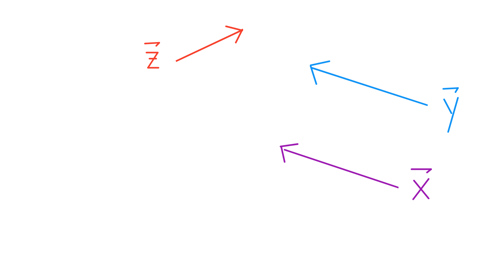
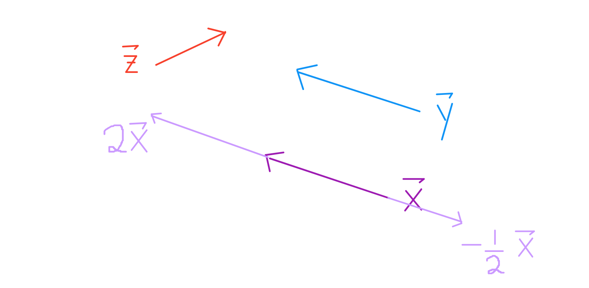
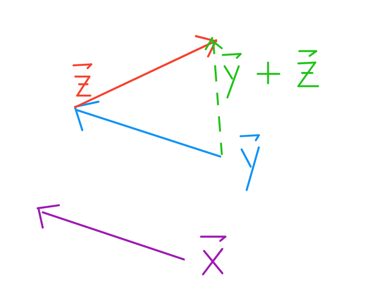
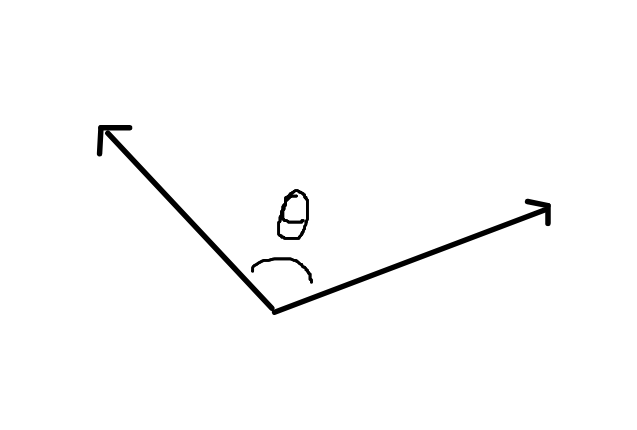
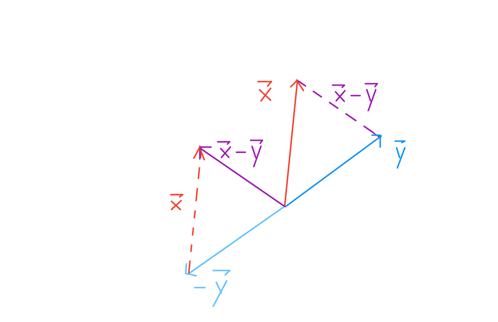
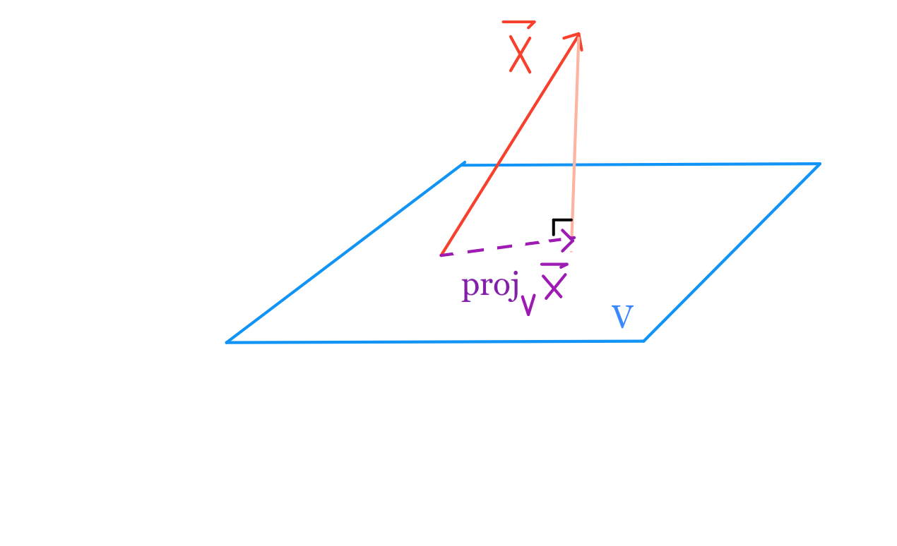

# Vector Space Review
- [Definition of a vector](#Definition-of-a-vector)
- [Scaling and adding vectors](#Scaling-and-adding-vectors)
- [Vector notations](#Vector-notations)
- [The $\vec{1}$ vector](#The-$\vec{1}$-vector)

- [Span of a set of vectors](#Span-of-a-set-of-vectors)
- [Vector spaces](#Vector-spaces)
- [Vector subspaces](#Vector-subspaces)

- [Angles between vectors](#Angles-between-vectors)
- [Vector lengths](#Vector-lengths)
- [Distance between two vectors](#Distance-between-two-vectors)
- [Orthogonal vectors](#Orthogonal-vectors)
- [Projections of vectors](#Projections-of-vectors)

### Definition of a vector
A vector is defined by a length and a direction.

Notice that $\vec{x}$ and $\vec{y}$ have the same length and direction. They are equal vectors.

### Scaling and adding vectors
To scale a vector is to change it's length.

Notice that $\vec{2x}$ and $\vec{y}$ have the direction but different lengths. They are not equal.

To add two vectors $\vec{y} + \vec{z}$, take one step according to the length of $\vec{y}$, then immediately take one step according to the length of $\vec{z}$ (or vice versa). This is also known as triangle method, where you place the initial point of a vector on the terminal point of the other.

### Vector notations
Vectors are usually represented as Cartesian Coordinates.

$$ \vec{x} = \begin{bmatrix} 1 \\ 4  \end{bmatrix} , \quad 
   \vec{y} = \begin{bmatrix} 3 \\ 2  \end{bmatrix} , \quad 
   \vec{z} = \begin{bmatrix} 4 \\ 0  \end{bmatrix}$$
   
In this notation, arithmetic operations we saw earlier become quite easy.

$$ \vec{2x} = \begin{bmatrix} 2 \\ 8  \end{bmatrix} , \quad
   \vec{-0.5z} = \begin{bmatrix} -2 \\ 0  \end{bmatrix} , \quad
   \vec{2x + -0.5z} = \begin{bmatrix} 0 \\ 8  \end{bmatrix}
$$

Vectors can be added and scaled element-wise:

$$a \vec{x} + b \vec{y} = \begin{bmatrix} a \ x_1 & + & b \  y_1 \\
                                            & \vdots & \\
                                          a \  x_n & + & b \  y_n
                          \end{bmatrix}
$$

### The $\vec{1}$ vector
In any $d$ dimensional space, $\vec{1}$ is the vector of all $1$'s: 
$ \begin{bmatrix} 1 \\ \vdots \\ 1  \end{bmatrix}$

### Span of a set of vectors
The span of a set of vectors $\{\vec{v_1}, \vec{v_2}, \dots, \vec{v_p}\}$ is the set of all possible linear combinations. For these $p$ vectors:

$$ \{ c_1 \ \vec{v_1} + c_2 \ \vec{v_2} + \dots + c_p \ \vec{v_p} \ : \ \forall c_i \in F\}$$

where $F$ is the field of the vector space (out of scope).

### Vector spaces
A vector space $V$ is the span of a set of vectors $\{\vec{v_1}, \vec{v_2}, \dots, \vec{v_p}\}$, where each $\vec{v_i}$ is a $n \times 1$ dimensional column vector.

### Vector subspaces
A subspace $U$ of $V$ is the span of a set of vectors $\{\vec{u_1}, \dots, \vec{u_q}\}$ where each $\vec{u_i} \in V$. This means every vector in $U$ is also in $V$.

### Angles between vectors
When you put any two vectors terminal end to terminal end without changing their direction, you can measure the angle between them.

### Vector lengths

Intuition in $\mathbb{R}^2$ :

Recall the triangle method of adding two vectors. If we add two perpendicular vectors $\vec{a} + \vec{b}$ in $\mathbb{R}^2$, then we know that the resulting vector will be the hypotenuse. In this case, we also know that the length of $\vec{a} + \vec{b}$ will follow the Pythagorean Theorem: $\sqrt{a^2 + b^2}$.

General Formula for  Length of $\vec{v} \in \mathbb{R}^n$ :
$$\begin{aligned} || \vec{v} || \quad
&=  \quad \sqrt{v_1^2 + v_2^2 + \dots + v_n^2}  \\
&= \quad \sqrt{\vec{v} \cdot \vec{v}}
\end{aligned}
$$

Where the final operator is the dot product.

$$ \begin{aligned}
\vec{x} \cdot \vec{y} \quad 
&= \quad x_1 \ y_1 + x_2 \ y_2 + \dots + x_n \ y_n \\
&= \quad||x|| \ ||y|| \ \cos{\theta}
\end{aligned}
$$

The first expression is known as the algebraic definition of the dot product, and the second is the geometric definition. Note that the dot product is the inner product defined for vectors in $\mathbb{R}^n$. 

### Distance between two vectors
$$dist(\vec{x},\vec{y}) \quad = \quad || \vec{x} - \vec{y} ||$$

### Orthogonal vectors
For two non-zero vectors to be orthogonal, they must satisfy the property that $\vec{x} \cdot \vec{y} = 0$. Since they have non-zero length, the only way for the two vectors to be orthogonal is if $\cos{\theta} = 0$. One satisfying $\theta$ is 90 degrees, our familiar right angle.

### Projections of vectors
To project one vector $\vec{x}$ onto another vector $\vec{y}$, we want to find $k \ \vec{y}$ that is closest to $\vec{x}$.

By the Pythagorean Theorem, we know that $k$ must be the scalar such that $\vec{x} - k \ \vec{y}$ is perpendicular to $\vec{y}$, so  $k \ \vec{y}$ is the (orthogonal) projection of $\vec{x}$ onto $\vec{y}$.

Likewise, to project one vector $\vec{x}$ onto any vector space spanned by some set of vectors $\{\vec{v_1}, \vec{v_2}, \dots, \vec{v_p}\}$, we still find the linear combination $k_1 \ \vec{v_1} + k_2 \ \vec{v_2} + \dots + k_p \ \vec{v_p}\}$ that is closest to $\vec{x}$.

