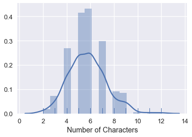

<h1>Table of Contents<span class="tocSkip"></span></h1>
<div class="toc"><ul class="toc-item"><li><span><a href="#Exploratory-Data-Analysis" data-toc-modified-id="Exploratory-Data-Analysis-1">Exploratory Data Analysis</a></span></li><li><span><a href="#What's-in-a-Name?" data-toc-modified-id="What's-in-a-Name?-2">What's in a Name?</a></span></li></ul></div>


```python
# HIDDEN
import numpy as np
import matplotlib.pyplot as plt
import pandas as pd
import seaborn as sns
%matplotlib inline

import ipywidgets as widgets
from ipywidgets import interact, interactive, fixed, interact_manual
import nbinteract as nbi

sns.set()
sns.set_context('talk')
pd.options.display.max_rows = 7
```


```python
# HIDDEN
students = pd.read_csv('roster.csv')
students['Name'] = students['Name'].str.lower()
```

## Exploratory Data Analysis

The term Exploratory Data Analysis (EDA for short) refers to the process of discovering traits about our data that inform future analysis.

Here's the `students` table from the previous page:


```python
students
```


<div>
<style scoped>
    .dataframe tbody tr th:only-of-type {
        vertical-align: middle;
    }

    .dataframe tbody tr th {
        vertical-align: top;
    }

    .dataframe thead th {
        text-align: right;
    }
</style>
<table border="1" class="dataframe">
  <thead>
    <tr style="text-align: right;">
      <th></th>
      <th>Name</th>
      <th>Role</th>
    </tr>
  </thead>
  <tbody>
    <tr>
      <th>0</th>
      <td>keeley</td>
      <td>Student</td>
    </tr>
    <tr>
      <th>1</th>
      <td>john</td>
      <td>Student</td>
    </tr>
    <tr>
      <th>2</th>
      <td>bryan</td>
      <td>Student</td>
    </tr>
    <tr>
      <th>...</th>
      <td>...</td>
      <td>...</td>
    </tr>
    <tr>
      <th>276</th>
      <td>ernesto</td>
      <td>Waitlist Student</td>
    </tr>
    <tr>
      <th>277</th>
      <td>athan</td>
      <td>Waitlist Student</td>
    </tr>
    <tr>
      <th>278</th>
      <td>michael</td>
      <td>Waitlist Student</td>
    </tr>
  </tbody>
</table>
<p>279 rows × 2 columns</p>
</div>


We are left with a number of questions. How many students are in this roster? What does the `Role` column mean? We conduct EDA in order to understand our data more thoroughly.

**In Data 100 we will study exploratory data analysis and practice analyzing new datasets.**

Oftentimes, we explore the data by repeatly posing simple questions about the data that we'd like to know about. We will structure our analysis this way.

**How many students are in our dataset?**


```python
print("There are", len(students), "students on the roster.")
```

    There are 279 students on the roster.


A natural follow-up question is whether this is the complete list of students or not. In this case, we happen to know that this list contains all students in the class.

**What is the meaning of the `Role` field?**

Understanding the meaning of field can often be achieved by looking at the unique values of the field's data:


```python
students['Role'].value_counts().to_frame()
```


<div>
<style scoped>
    .dataframe tbody tr th:only-of-type {
        vertical-align: middle;
    }

    .dataframe tbody tr th {
        vertical-align: top;
    }

    .dataframe thead th {
        text-align: right;
    }
</style>
<table border="1" class="dataframe">
  <thead>
    <tr style="text-align: right;">
      <th></th>
      <th>Role</th>
    </tr>
  </thead>
  <tbody>
    <tr>
      <th>Student</th>
      <td>237</td>
    </tr>
    <tr>
      <th>Waitlist Student</th>
      <td>42</td>
    </tr>
  </tbody>
</table>
</div>


We can see here that our data contain not only students enrolled in the class at the time but also the students on the waitlist. The `Role` column tells us whether each student is enrolled.

**What about the names?  How can we summarize this field?**

In Data 100 we will deal with many different kinds of data (not just numbers) and we will study techniques to diverse types of data.

A good starting point might be to examine the lengths of the strings.


```python
sns.distplot(students['Name'].str.len(), rug=True, axlabel="Number of Characters")
```


    <matplotlib.axes._subplots.AxesSubplot at 0x10e6fd0b8>





This visualization shows us that most names are between 3 and 9 characters long. This gives us a chance to check whether our data seem reasonable — if there were many names that were 1 character long we'd have good reason to re-examine our data.

## What's in a Name?

Although this dataset is rather simple, we will soon see that first names alone can reveal quite a bit about our class.
