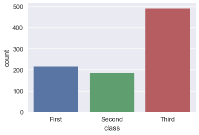
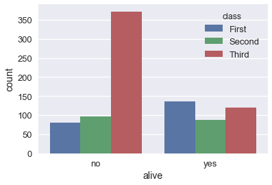
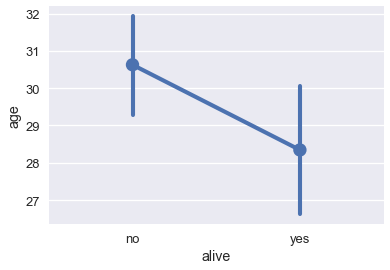

<h1>Table of Contents<span class="tocSkip"></span></h1>
<div class="toc"><ul class="toc-item"><li><span><a href="#Visualizing-Qualitative-Data" data-toc-modified-id="Visualizing-Qualitative-Data-1">Visualizing Qualitative Data</a></span><ul class="toc-item"><li><span><a href="#Bar-Charts" data-toc-modified-id="Bar-Charts-1.1">Bar Charts</a></span></li><li><span><a href="#Dot-Charts" data-toc-modified-id="Dot-Charts-1.2">Dot Charts</a></span></li></ul></li></ul></div>


```python
# HIDDEN
import numpy as np
import matplotlib.pyplot as plt
import pandas as pd
import seaborn as sns
%matplotlib inline
import ipywidgets as widgets
from ipywidgets import interact, interactive, fixed, interact_manual
import nbinteract as nbi

sns.set()
sns.set_context('talk')
pd.options.display.max_rows = 7
pd.options.display.max_columns = 8
```


```python
# HIDDEN
def df_interact(df):
    '''
    Outputs sliders that show rows and columns of df
    '''
    def peek(row=0, col=0):
        return df.iloc[row:row + 5, col:col + 8]
    interact(peek, row=(0, len(df), 5), col=(0, len(df.columns) - 6))
    print('({} rows, {} columns) total'.format(df.shape[0], df.shape[1]))
```

## Visualizing Qualitative Data

For qualitative or categorical data, we most often use bar charts and dot charts. We will show how to create these plots using `seaborn` and the Titanic survivors dataset.


```python
# Import seaborn and apply its plotting styles
import seaborn as sns
sns.set()

# Load the dataset
ti = sns.load_dataset('titanic').reset_index(drop=True)

# This table is too large to fit onto a page so we'll output sliders to
# pan through different sections.
df_interact(ti)
```


    A Jupyter Widget


    (891 rows, 15 columns) total


### Bar Charts

In `seaborn`, there are two types of bar charts. The first type uses the `countplot` method to count up the number of times each category appears in a column.


```python
# Counts how many passengers survived and didn't survive and
# draws bars with corresponding heights
sns.countplot(x='alive', data=ti);
```





```python
sns.countplot(x='class', data=ti);
```


```python
# As with box plots, we can break down each category further using color
sns.countplot(x='alive', hue='class', data=ti);
```





The `barplot` method, on the other hand, groups the DataFrame by a categorical column and plots the height of the bars according to the average of a numerical column within each group.


```python
# For each set of alive/not alive passengers, compute and plot the average age.
sns.barplot(x='alive', y='age', data=ti);
```


The height of each bar can be computed by grouping the original DataFrame and averaging the `age` column:


```python
ti[['alive', 'age']].groupby('alive').mean()
```


<div>
<style scoped>
    .dataframe tbody tr th:only-of-type {
        vertical-align: middle;
    }

    .dataframe tbody tr th {
        vertical-align: top;
    }

    .dataframe thead th {
        text-align: right;
    }
</style>
<table border="1" class="dataframe">
  <thead>
    <tr style="text-align: right;">
      <th></th>
      <th>age</th>
    </tr>
    <tr>
      <th>alive</th>
      <th></th>
    </tr>
  </thead>
  <tbody>
    <tr>
      <th>no</th>
      <td>30.626179</td>
    </tr>
    <tr>
      <th>yes</th>
      <td>28.343690</td>
    </tr>
  </tbody>
</table>
</div>


By default, the `barplot` method will also compute a bootstrap 95% confidence interval for each averaged value, marked as the black lines in the bar chart above. The confidence intervals show that if the dataset contained a random sample of Titanic passengers, the difference between passenger age for those that survived and those that didn't is not statistically significant at the 5% significance level.

These confidence intervals take long to generate when we have larger datasets so it is sometimes useful to turn them off:


```python
sns.barplot(x='alive', y='age', data=ti, ci=False);
```


### Dot Charts

Dot charts are similar to bar charts. Instead of plotting bars, dot charts mark a single point at the end of where a bar would go. We use the `pointplot` method to make dot charts in `seaborn`. Like the `barplot` method, the `pointplot` method also automatically groups the DataFrame and computes the average of a separate numerical variable, marking 95% confidence intervals as vertical lines centered on each point.


```python
# For each set of alive/not alive passengers, compute and plot the average age.
sns.pointplot(x='alive', y='age', data=ti);
```





Dot charts are most useful when comparing changes across categories:


```python
# Shows the proportion of survivors for each passenger class
sns.pointplot(x='class', y='survived', data=ti);
```


```python
# Shows the proportion of survivors for each passenger class,
# split by whether the passenger was an adult male
sns.pointplot(x='class', y='survived', hue='adult_male', data=ti);
```


