<h1>Table of Contents<span class="tocSkip"></span></h1>
<div class="toc"><ul class="toc-item"><li><span><a href="#Absolute-and-Huber-Cost" data-toc-modified-id="Absolute-and-Huber-Cost-1">Absolute and Huber Cost</a></span><ul class="toc-item"><li><span><a href="#Comparing-MSE-and-Mean-Absolute-Cost" data-toc-modified-id="Comparing-MSE-and-Mean-Absolute-Cost-1.1">Comparing MSE and Mean Absolute Cost</a></span></li><li><span><a href="#Outliers" data-toc-modified-id="Outliers-1.2">Outliers</a></span></li><li><span><a href="#Minimizing-the-Mean-Absolute-Loss" data-toc-modified-id="Minimizing-the-Mean-Absolute-Loss-1.3">Minimizing the Mean Absolute Loss</a></span></li><li><span><a href="#MSE-and-Mean-Absolute-Cost-Comparison" data-toc-modified-id="MSE-and-Mean-Absolute-Cost-Comparison-1.4">MSE and Mean Absolute Cost Comparison</a></span></li><li><span><a href="#The-Huber-Cost" data-toc-modified-id="The-Huber-Cost-1.5">The Huber Cost</a></span></li></ul></li></ul></div>


```python
# HIDDEN
import numpy as np
import matplotlib.pyplot as plt
import pandas as pd
import seaborn as sns
%matplotlib inline
import ipywidgets as widgets
from ipywidgets import interact, interactive, fixed, interact_manual
import nbinteract as nbi

sns.set()
sns.set_context('talk')
pd.options.display.max_rows = 7
pd.options.display.max_columns = 8
```


```python
# HIDDEN
tips = sns.load_dataset('tips')
tips['pcttip'] = tips['tip'] / tips['total_bill'] * 100
```


```python
# HIDDEN
def mse_cost(theta, y_vals):
    return np.mean((y_vals - theta) ** 2)

def abs_cost(theta, y_vals):
    return np.mean(np.abs(y_vals - theta))
```


```python
# HIDDEN
def compare_mse_abs(thetas, y_vals, xlims, figsize=(10, 7), cols=3):
    if not isinstance(y_vals, np.ndarray):
        y_vals = np.array(y_vals)
    rows = int(np.ceil(len(thetas) / cols))
    plt.figure(figsize=figsize)
    for i, theta in enumerate(thetas):
        ax = plt.subplot(rows, cols, i + 1)
        sns.rugplot(y_vals, height=0.1, ax=ax)
        plt.axvline(theta, linestyle='--',
                    label=rf'$ \theta = {theta} $')
        plt.title(f'MSE Cost = {mse_cost(theta, y_vals):.2f}\n'
                  f'Mean Abs Cost = {abs_cost(theta, y_vals):.2f}')
        plt.xlim(*xlims)
        plt.yticks([])
        plt.legend()
    plt.tight_layout()
```

## Absolute and Huber Cost

Previously, we said that our model is accurate if it minimizes the squared difference between the predictions and the actual values. We used the mean squared error (MSE) cost to capture this measure of accuracy:

$$
\begin{aligned}
L(\theta, y)
&= \frac{1}{n} \sum_{i = 1}^{n}(y_i - \theta)^2\\
\end{aligned}
$$

We used a simple model that always predicts the same number:

$$ \theta = C $$

Where $ C $ is some constant. When we use this constant model and the MSE cost function, we found that $ C $ will always be the mean of the data points. When applied to the tips dataset, we found that the constant model should predict $ 16.08\% $ since $ 16.08\% $ is the mean of the tip percents.

Now, we will keep our model the same but switch to a different cost function: the mean absolute cost. Instead taking the squared difference for each point and our prediction, this cost function takes the absolute difference:

$$
\begin{aligned}
L(\theta, y)
&= \frac{1}{n} \sum_{i = 1}^{n} |y_i - \theta| \\
\end{aligned}
$$

**Brief Aside: Cost Functions vs. Loss Functions**

We typically use the term *cost function* to describe a function that takes in parameters of our model (e.g. $ \theta $) and the entire set of data that we are interested in (e.g. $ y $). This function generates a single value that describes how well the model does on a given set of points.

We typically use the term *loss function* to describe a function that takes in parameters of our model (e.g. $ \theta $) and one point from the data that we are interested in (e.g. $ y_i $). For example, $ (y_i - \theta)^2 $ is the squared loss, and $ |y_i - \theta| $ is the absolute loss. Notice that there is no summation in these example loss functions. You can think of a cost function as the combination of multiple loss function values.

### Comparing MSE and Mean Absolute Cost

To get a better sense of how the MSE cost and mean absolute cost compare, let's compare their costs on different datasets. First, we'll use our dataset of one point: $ y = [14] $.


```python
# HIDDEN
compare_mse_abs(thetas=[11, 12, 13, 14, 15, 16],
                y_vals=[14], xlims=(10, 17))
```


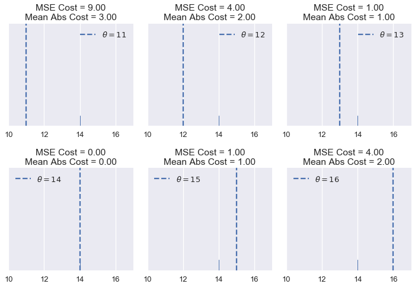


We see that the MSE cost is usually higher than the mean absolute cost since the error is squared. Let's see what happens when have five points: $ y = [ 12.1, 12.8, 14.9, 16.3, 17.2 ] $


```python
# HIDDEN
compare_mse_abs(thetas=[12, 13, 14, 15, 16, 17],
                y_vals=[12.1, 12.8, 14.9, 16.3, 17.2],
                xlims=(11, 18))
```


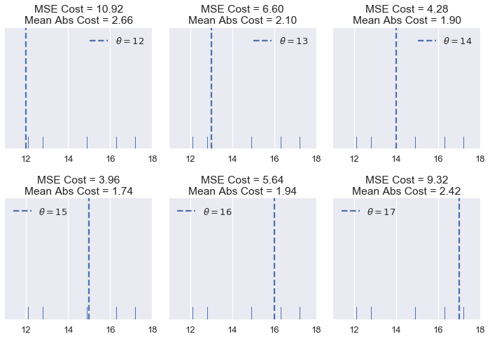


Remember that the actual cost values themselves are not very interesting to us; they are only useful for comparing different values of $ \theta $. Once we choose a cost function, we will look for the $ \theta $ that produces the least cost. Thus, we are interested in whether the cost functions are minimized by different values of $ \theta $.

So far, the two cost functions seem to agree on the $ \theta $ values that produce the least cost for the values that we've tried. If we look a bit closer, however, we will start to see some differences. We first take the costs and plot them against $ \theta $ for each of the six $ \theta $ values we tried.


```python
# HIDDEN
thetas = np.array([12, 13, 14, 15, 16, 17])
y_vals = np.array([12.1, 12.8, 14.9, 16.3, 17.2])
mse_costs = [mse_cost(theta, y_vals) for theta in thetas]
abs_costs = [abs_cost(theta, y_vals) for theta in thetas]

plt.scatter(thetas, mse_costs, label='MSE Cost')
plt.scatter(thetas, abs_costs, label='Abs Cost')
plt.title(r'Cost vs. $ \theta $ when $ y = [ 12.1, 12.8, 14.9, 16.3, 17.2 ] $')
plt.xlabel(r'$ \theta $ Values')
plt.ylabel('Cost')
plt.legend();
```


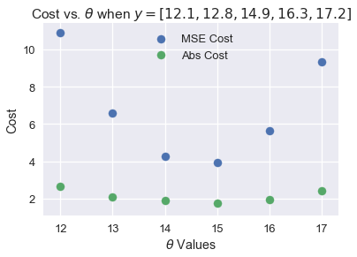


Then, we compute more values of $ \theta $ so that the curve is smooth:


```python
# HIDDEN
thetas = np.arange(12, 17.1, 0.05)
y_vals = np.array([12.1, 12.8, 14.9, 16.3, 17.2])
mse_costs = [mse_cost(theta, y_vals) for theta in thetas]
abs_costs = [abs_cost(theta, y_vals) for theta in thetas]

plt.plot(thetas, mse_costs, label='MSE Cost')
plt.plot(thetas, abs_costs, label='Abs Cost')
plt.title(r'Cost vs. $ \theta $ when $ y = [ 12.1, 12.8, 14.9, 16.3, 17.2 ] $')
plt.xlabel(r'$ \theta $ Values')
plt.ylabel('Cost')
plt.legend();
```


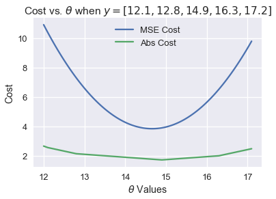


Then, we zoom into the region between 1.5 and 5 on the y-axis to see the difference in minima more clearly. We've marked the minima with dotted lines.


```python
# HIDDEN
thetas = np.arange(12, 17.1, 0.05)
y_vals = np.array([12.1, 12.8, 14.9, 16.3, 17.2])
mse_costs = [mse_cost(theta, y_vals) for theta in thetas]
abs_costs = [abs_cost(theta, y_vals) for theta in thetas]

plt.plot(thetas, mse_costs, label='MSE Cost')
plt.plot(thetas, abs_costs, label='Abs Cost')
plt.axvline(np.mean(y_vals), c=sns.color_palette()[0], linestyle='--',
            alpha=0.7, label='Minima of MSE cost')
plt.axvline(np.median(y_vals), c=sns.color_palette()[1], linestyle='--',
            alpha=0.7, label='Minima of abs cost')


plt.title(r'Cost vs. $ \theta $ when $ y = [ 12.1, 12.8, 14.9, 16.3, 17.2 ] $')
plt.xlabel(r'$ \theta $ Values')
plt.ylabel('Cost')
plt.ylim(1.5, 5)
plt.legend();
```


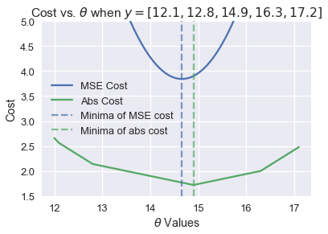


We've found empirically that the MSE cost and mean absolute cost can be minimized by different values of $ \theta $ for the same dataset. However, we don't have a good sense of when they will differ and more importantly, why they differ.

### Outliers

One difference that we can see in the plots of cost vs. $ \theta $ above lies in the shape of the cost curves. Plotting the MSE cost results in a parabolic curve resulting from the squared term in the cost function.

Plotting the mean absolute cost, on the other hand, results in what looks like a connected series of lines. This makes sense when we consider that the absolute value function is linear, so taking the average of many absolute value functions should produce a semi-linear function.

Since the MSE cost has a squared error term, it will be more sensitive to outliers. If $ \theta = 10 $ and a point lies at 110, that point's error term for MSE will be $ (10 - 110)^2 = 10000 $ whereas in the mean absolute cost, that point's error term will be $ |10 - 110| = 100 $. We can illustrate this by taking a set of three points $ y = [ 12, 13, 14 ] $ and plotting the cost vs. $ \theta $ curves for MSE and mean absolute loss.

Use the slider below to move the third point further away from the rest of the data and observe what happens to the cost curves. (We've scaled the curves to keep both in view since the MSE cost has larger values than the mean absolute cost.)


```python
# HIDDEN
def compare_mse_abs_curves(y3=14):
    thetas = np.arange(11.5, 26.5, 0.1)
    y_vals = np.array([12, 13, y3])
    
    mse_costs = [mse_cost(theta, y_vals) for theta in thetas]
    abs_costs = [abs_cost(theta, y_vals) for theta in thetas]
    mse_abs_diff = min(mse_costs) - min(abs_costs)
    mse_costs = [cost - mse_abs_diff for cost in mse_costs]
    
    plt.figure(figsize=(9, 2))
    
    ax = plt.subplot(121)
    sns.rugplot(y_vals, height=0.3, ax=ax)
    plt.xlim(11.5, 26.5)
    plt.xlabel('Points')
    
    ax = plt.subplot(122)
    plt.plot(thetas, mse_costs, label='MSE Cost')
    plt.plot(thetas, abs_costs, label='Abs Cost')
    plt.xlim(11.5, 26.5)
    plt.ylim(min(abs_costs) - 1, min(abs_costs) + 10)
    plt.xlabel(r'$ \theta $')
    plt.ylabel('Cost')
    plt.legend()
```


```python
# HIDDEN
interact(compare_mse_abs_curves, y3=(14, 25));
```


    A Jupyter Widget


We've shown the curves for $ y_3 = 14 $ and $ y_3 = 25 $ below.


```python
# HIDDEN
compare_mse_abs_curves(y3=14)
```


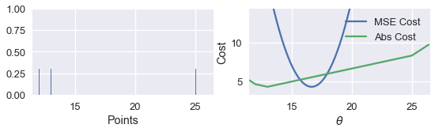


```python
# HIDDEN
compare_mse_abs_curves(y3=25)
```


As we move the point further away from the rest of the data, the MSE cost curve moves with it. When $ y_3 = 14 $, both MSE and mean absolute cost will be minimized by the same value of $ \theta $ at $ \theta = 13 $. However, when $ y_3 = 25 $, the MSE curve will tell us that the best $ \theta $ is around 16.7 while the mean absolute cost will still say that $ \theta = 13 $ is best.

### Minimizing the Mean Absolute Loss

Now that we have a qualitative sense of how the MSE and mean absolute cost differ, we can minimize the mean absolute cost to make this difference more precise. As before, we will take the derivative of the cost function with respect to $ \theta $ and set it equal to zero.

This time, however, we have to deal with the fact that the absolute function is not always differentiable. When $ x > 0 $, $ \frac{\partial}{\partial x} |x| = 1 $. When $ x < 0 $, $ \frac{\partial}{\partial x} |x| = -1 $. Although $ |x| $ is not technicaly differentiable at $ x = 0 $, we will set $ \frac{\partial}{\partial x} |x| = 0 $ so that the equations are easier to work with.

Recall that the equation for the mean absolute loss is:

$$
\begin{aligned}
L(\theta, y)
&= \frac{1}{n} \sum_{i = 1}^{n}|y_i - \theta|\\
&= \frac{1}{n} \left( \sum_{y_i < \theta}|y_i - \theta| + \sum_{y_i = \theta}|y_i - \theta| + \sum_{y_i > \theta}|y_i - \theta| \right)\\
\end{aligned}
$$

In the line above, we've split up the summation into three separate summations: one that has one term for each $ y_i < \theta $, one for $ y_i = \theta $, and one for $ y_i > \theta $. Why make the summation seemingly more complicated? If we know that $ y_i < \theta $ we also know that $ |y_i - \theta| < 0 $ and thus $ \frac{\partial}{\partial \theta} |y_i - \theta| = -1 $ from before. A similar logic holds for each term above to make taking the derivative much easier.

Now, we take the derivative with respect to $ \theta $ and set it equal to zero:

$$
\begin{aligned}
\frac{1}{n} \left( \sum_{y_i < \theta}(-1) + \sum_{y_i = \theta}(0) + \sum_{y_i > \theta}(1) \right) &= 0 \\
\sum_{y_i < \theta}(-1) + \sum_{y_i > \theta}(1) &= 0 \\
-\sum_{y_i < \theta}(1) + \sum_{y_i > \theta}(1) &= 0 \\
\sum_{y_i < \theta}(1) &= \sum_{y_i > \theta}(1) \\
\end{aligned}
$$

What does the result above mean? On the left hand side, we have one term for each data point less than $ \theta $. On the right, we have one for each data point greater than $ \theta $. Then, in order to satisfy the equation we need to pick a value for $ \theta $ that has the same number of smaller and larger points. This is the definition for the *median* of a set of numbers. Thus, the minimizing value of $ \theta $ for the mean absolute cost is $ \theta = \text{median} (y) $.

When we have an odd number of points, the median is simply the middle point when the points are arranged in sorted order. We can see that in the example below with five points, the cost is minimized when $ \theta $ lies at the median:


```python
# HIDDEN
def points_and_cost(y_vals, xlim, cost_fn=abs_cost):
    thetas = np.arange(xlim[0], xlim[1] + 0.01, 0.05)
    abs_costs = [cost_fn(theta, y_vals) for theta in thetas]
    
    plt.figure(figsize=(9, 2))
    
    ax = plt.subplot(121)
    sns.rugplot(y_vals, height=0.3, ax=ax)
    plt.xlim(*xlim)
    plt.xlabel('Points')
    
    ax = plt.subplot(122)
    plt.plot(thetas, abs_costs)
    plt.xlim(*xlim)
    plt.xlabel(r'$ \theta $')
    plt.ylabel('Cost')
    plt.legend()
points_and_cost(np.array([10, 11, 12, 14, 15]), (9, 16))
```


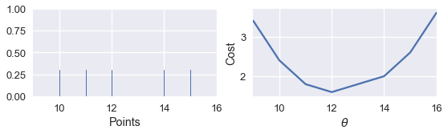


However, when we have an even number of points, the cost is minimized when $ \theta $ is any value in between the two central points.


```python
# HIDDEN
points_and_cost(np.array([10, 11, 14, 15]), (9, 16))
```


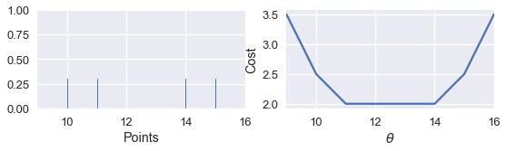


This is not the case when we use the MSE cost:


```python
# HIDDEN
points_and_cost(np.array([10, 11, 14, 15]), (9, 16), mse_cost)
```


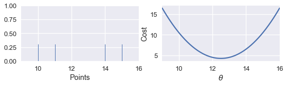


### MSE and Mean Absolute Cost Comparison

Our investigation and the derivation above show that the MSE is easier to differentiate but is more sensitive to outliers than the mean absolute cost. The minimizing $ \theta $ for MSE is the mean of the data points, and the minimizing $ \theta $ for the mean absolute cost is the median of the data points. Notice that the median is robust to outliers while the mean is not! This phenomenon arises from our construction of the two cost functions.

We have also seen that the MSE cost will be minimized by a unique value of $ \theta $, whereas the mean absolute value can be minimized by multiple values of $ \theta $ when there are an even number of data points.

In the examples so far, the ability to differentiate the cost function isn't that useful since we know the exact minimizing value of $ \theta $ in both cases. However, the ability to differentiate the cost function becomes very important once we start using complicated models. For complicated models, we will not be able to differentiate the cost function by hand and will need a computer to minimize the cost function for us. We will return to this issue when we cover gradient descent and numerical optimization.

### The Huber Cost

A third loss function called the Huber loss combines both the MSE and mean absolute loss to create a loss function that is differentiable *and* robust to outliers. The Huber loss accomplishes this by behaving like the MSE loss function at values close to $ \theta $ and switching to the absolute loss for values far from $ \theta $.

As usual, we create a cost function by taking the mean of the Huber losses for each point in our dataset.

Let's see what the Huber cost function outputs for a dataset of $ y = [14] $ as we vary $ \theta $:


```python
# HIDDEN
def huber_loss(est, y_obs, alpha = 1):
    d = np.abs(est - y_obs)
    return np.where(d < alpha, 
                    (est - y_obs)**2 / 2.0,
                    alpha * (d - alpha / 2.0))

thetas = np.linspace(0, 50, 200)
loss = huber_loss(thetas, np.array([14]), alpha=5)
plt.plot(thetas, loss, label="Huber Loss")
plt.vlines(np.array([14]), -20, -5,colors="r", label="Observation")
plt.xlabel(r"Choice for $\theta$")
plt.ylabel(r"Loss")
plt.legend()
plt.savefig('huber_loss.pdf')
```


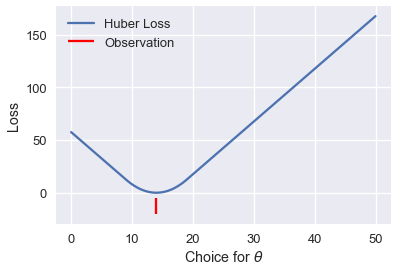


We can see that the Huber cost is smooth, unlike the mean absolute cost. The Huber cost also increases at a linear rate, unlike the quadratic rate of the mean squared cost.

The Huber cost does have a drawback, however. Notice that it transitions from the MSE to the mean absolute cost once $ \theta $ gets far enough from the point. We can tweak this "far enough" to get different cost curves. For example, we can make it transition once $ \theta $ is just one unit away from the observation:


```python
# HIDDEN
loss = huber_loss(thetas, np.array([14]), alpha=1)
plt.plot(thetas, loss, label="Huber Loss")
plt.vlines(np.array([14]), -20, -5,colors="r", label="Observation")
plt.xlabel(r"Choice for $\theta$")
plt.ylabel(r"Loss")
plt.legend()
plt.savefig('huber_loss.pdf')
```


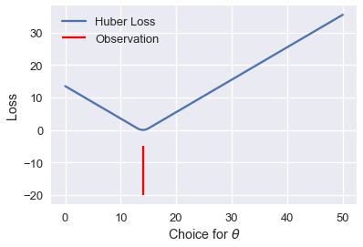


Or we can make it transition when $ \theta $ is ten units away from the observation:


```python
# HIDDEN
loss = huber_loss(thetas, np.array([14]), alpha=10)
plt.plot(thetas, loss, label="Huber Loss")
plt.vlines(np.array([14]), -20, -5,colors="r", label="Observation")
plt.xlabel(r"Choice for $\theta$")
plt.ylabel(r"Loss")
plt.legend()
plt.savefig('huber_loss.pdf')
```


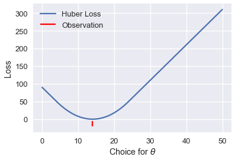


This choice results in a different cost curve and can thus result in different values of $ \theta $. If we want to use the Huber cost function, we have the additional task of setting this transition point to a suitable value.

The Huber cost function is defined mathematically as follows:

$$
L_\alpha(\theta, y) = \frac{1}{n} \sum_{i=1}^n \begin{cases}
    \frac{1}{2}(y_i - \theta)^2 &  | y_i - \theta | \le \alpha \\
    \alpha ( |y_i - \theta| - \frac{1}{2}\alpha ) & \text{otherwise}
\end{cases}
$$

It is more complex than the previous cost functions because it combines both MSE and mean absolute cost. The additional parameter $ \alpha $ sets the point where the Huber loss transitions from the MSE cost to the absolute cost.

Attempting to take the derivative of the Huber loss function is tedious and does not result in an elegant result like the MSE and mean absolute loss. Instead, we can use a computational method called gradient descent to find minimizing value of $ \theta $.
