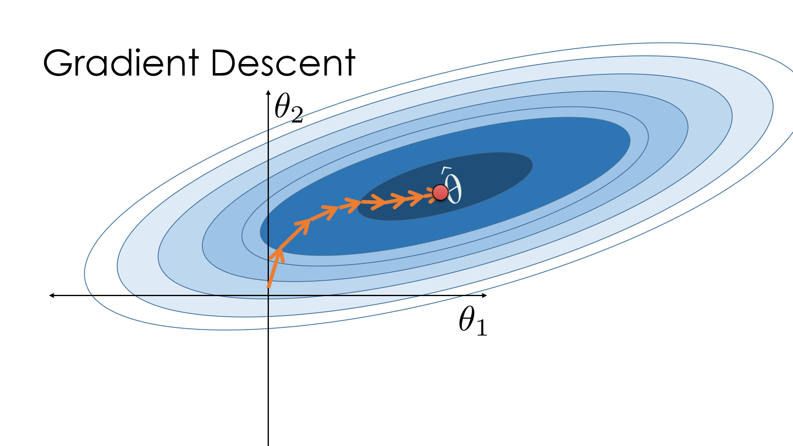
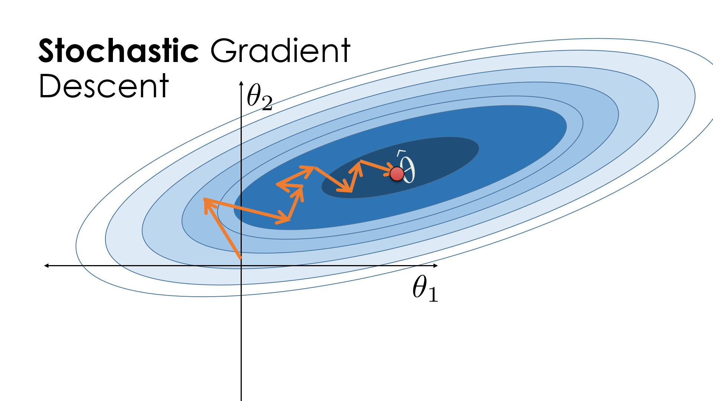

```python
# HIDDEN
import numpy as np
import matplotlib.pyplot as plt
import pandas as pd
import seaborn as sns
%matplotlib inline
import ipywidgets as widgets
from ipywidgets import interact, interactive, fixed, interact_manual
import nbinteract as nbi

sns.set()
sns.set_context('talk')
np.set_printoptions(threshold=20, precision=2, suppress=True)
np.random.seed(42)
pd.options.display.max_rows = 7
pd.options.display.max_columns = 8
pd.set_option('precision', 2)
```

## A Brief Review

We initially fit our model to the tips dataset by finding the $\hat\theta_0$ that minimized the MSE loss function, $L(\hat\theta_0, y) = \frac{1}{n} \sum_{i=1}^{n}(y_i - \hat\theta_0)^2$. To calculate the minimizing value of $\hat{\theta_0}$, we took the derivative of the MSE, set it equal to zero, and solved for $\hat\theta_0$. We found that the optimal $\hat\theta_0$ value was simply the mean of the $y$ values in our dataset.

However, for more complicated models and loss functions, there may not be simple algebraic expressions that yield the loss-minimizing $\hat\theta_0$ values. Instead, we use the gradient descent algorithm to iteratively improve $\hat\theta_0$ until convergence at a loss minimum. To complete an iteration of gradient descent, we calculate the following:

$$
\hat{\theta}_{t+1} = \hat\theta_t - \alpha \cdot \nabla_{\theta} L(\hat\theta, y)
$$

In this equation:
- $\hat\theta_{t}$ is our current estimate of $\theta_0$ at the $t$th iteration
- $\alpha$ is the learning rate
- $\nabla_{\hat\theta} L(\hat\theta, y)$ is the gradient of the loss function
- We compute the next estimate $\hat\theta_{t+1}$ by subtracting the product of $\alpha$ and $\nabla_{\theta} L(\hat\theta, y)$ computed at $\hat\theta_{t}$

## Limitations of Gradient Descent

In the expression above, we calculate $\nabla_{\theta}L(\hat{\theta_0}, y)$ using the average gradient of the loss function $l(\hat{\theta_0}, y_i)$ across the entire dataset as a single batch. For this reason, this gradient update rule is often referred to as **batch gradient descent**.

For example, the gradient of the MSE loss first requires us to find the gradient of the squared loss, $\nabla_{\theta} l(\hat{\theta_0}, y_i) = -2 (y_i - \hat{\theta_0})$, for each of the $n$ observations in our dataset. The final gradient loss is the average of the individual gradients as the derivation below shows:

$$
\begin{align}
\nabla_{\theta} L(\hat{\theta_0}, y) &= -\frac{2}{n} \sum_{i=1}^{n}(y_i - \hat{\theta_0}) \\
&= \frac{1}{n} \sum_{i=1}^{n}-2(y_i - \hat{\theta_0}) \\
&= \frac{1}{n} \sum_{i=1}^{n} \nabla_{\theta} l(\hat{\theta_0}, y_i)
\end{align}
$$


Thus, for each iteration of batch gradient descent, we must compute the loss on every point in the dataset. Since datasets can contain many points, batch gradient descent can take a prohibitive amount of time to converge.

## Stochastic Gradient Descent

To circumvent the difficulty of computing a gradient across the entire training set, **stochastic gradient descent** approximates the overall gradient using a single randomly chosen data point. Since the observation is chosen randomly, we expect that using the gradient at each individual observation will eventually converge the algorithm to the same parameters as batch gradient descent. The modified update formula for stochastic gradient descent is presented below, where $l(\hat\theta, y_i)$ is the loss function for a single data point.

$$
\hat\theta_{t+1} = \hat\theta_t - \alpha \nabla_\hat\theta l(\hat\theta, y_i)
$$

Returning back to our example using the MSE, we approximate the gradient of the mean squared error using the gradient of the squared loss of one data point. 

$$
\begin{align}
\nabla_{\hat\theta}L(\hat\theta, y) &\approx \nabla_{\hat\theta} l(\hat\theta, y_i) \\
&= -2(y_i - \hat\theta)
\end{align}
$$

Stochastic gradient descent relies on the random selection of individual observations. This is statistically founded since the randomness means that $E[\nabla_{\hat\theta}l(\hat\theta, y_i)] = \nabla_{\hat\theta}L(\hat\theta, y)$. In practice, we choose these random data points by shuffling the training data and iteratively selecting from the shuffled data. An iteration through all $n$ observations of the shuffled data is called an **epoch**; at the end of every epoch, we reshuffle the data.

### Visualizing Stochastic Gradient Descent

Below are visual examples of loss minimization in batch gradient descent and stochastic gradient descent.




At each iteration of batch gradient descent, we move in the direction of the true gradient of the loss function, which is depicted by the ellipses. On the other hand, each iteration of stochastic gradient descent may not lead us in the direction of the true gradient; however, the $\hat\theta$ parameters eventually converge to the minima of the loss function. Although stochastic gradient descent typically takes more iterations to converge than batch gradient descent, it often converges more quickly because it spends significantly less time computing the update at each iteration.

### Defining a Function for Stochastic Gradient Descent

As we previously did for batch gradient descent, we define a function that computes the stochastic gradient descent of the loss function. It will be similar to our `minimize` function but we will need to implement the random selection of one observation at each iteration.


```python
def minimize_sgd(loss_fn, grad_loss_fn, dataset, alpha=0.2, progress=True):
    """
    Uses stochastic gradient descent to minimize loss_fn.
    Returns the minimizing value of theta once theta changes
    less than 0.001 between iterations.
    """
    NUM_OBS = len(dataset)
    theta = 0
    np.random.shuffle(dataset)
    while True:
        for i in range(0, NUM_OBS, 1):
            if progress:
                print(f'theta: {theta:.2f} | loss: {loss_fn(theta, dataset):.2f}')
            rand_obs = dataset[i]
            gradient = grad_loss_fn(theta, rand_obs)
            new_theta = theta - alpha * gradient
        
            if abs(new_theta - theta) < 0.1:
                return new_theta
        
            theta = new_theta
        np.random.shuffle(dataset)
```

## Mini-batch Gradient Descent

**Mini-batch gradient descent** strikes a balance between batch gradient descent and stochastic gradient descent by increasing the number of observations that we select at each iteration. In mini-batch gradient descent, we take a simple random sample of observations called a mini-batch. We use the average of the gradients of their loss functions to construct an estimate of the true gradient of the cross entropy loss. Since our sample is randomly selected, the expectation of this estimate is equal to the true gradient. This is illustrated in the approximation for the gradient of the loss function, where $\mathcal{B}$ is the mini-batch of data points that we randomly sample from the $n$ observations.

$$
\nabla_\theta L(\hat{\theta_0}, y) \approx \frac{1}{|\mathcal{B}|} \sum_{i\in\mathcal{B}}\nabla_{\theta}l(\hat{\theta_0}, y_i)
$$

As with stochastic gradient descent, we perform mini-batch gradient descent by shuffling our training data and selecting mini-batches by iterating through the shuffled data. After each epoch, we re-shuffle our data and select new mini-batches.

While we have made the distinction between stochastic and mini-batch gradient descent in this textbook, stochastic gradient descent is sometimes used as an umbrella term that encompasses the selection of a mini-batch of any size. 


### Selecting the Mini-Batch Size

Mini-batch gradient descent is most optimal when running on a Graphical Processing Unit (GPU) or on distributed systems. Since computations on these hardware machines can be executed in parallel, using a mini-batch can increase the accuracy of the gradient without increasing computation time. Depending on the memory of the GPU, the mini-batch size is often set between 10 and 100 observations. 

### Defining a Function for Mini-Batch Gradient Descent

A function for mini-batch gradient descent requires the ability to select a batch size. Below is a function that implements this feature.


```python
def minimize_mini_batch(loss_fn, grad_loss_fn, dataset, minibatch_size, alpha=0.2, progress=True):
    """
    Uses mini-batch gradient descent to minimize loss_fn.
    Returns the minimizing value of theta once theta changes
    less than 0.001 between iterations.
    """
    NUM_OBS = len(dataset)
    assert minibatch_size < NUM_OBS
    
    theta = 0
    np.random.shuffle(dataset)
    while True:
        for i in range(0, NUM_OBS, minibatch_size):
            if progress:
                print(f'theta: {theta:.2f} | loss: {loss_fn(theta, dataset):.2f}')
            
            mini_batch = dataset[i:i+minibatch_size]
            gradient = grad_loss_fn(theta, mini_batch)
            new_theta = theta - alpha * gradient
            
            if abs(new_theta - theta) < 0.1:
                return new_theta
            
            theta = new_theta
        np.random.shuffle(dataset)
```

## Summary

We use batch gradient descent to iteratively improve model parameters until the model achieves minimal loss. Since batch gradient descent is computationally intractable with large datasets, we often use stochastic gradient descent to fit models instead. Furthermore, when using a GPU, mini-batch gradient descent can converge more quickly than stochastic gradient descent for the same computational cost. For large datasets, stochastic gradient descent and mini-batch gradient descent are often preferred to batch gradient descent for their faster computation times.
