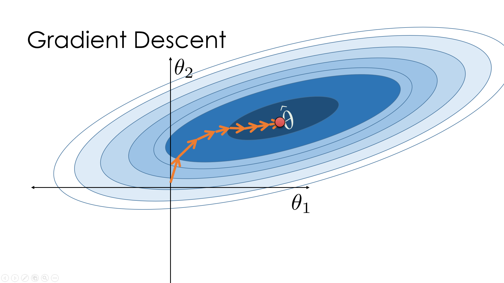
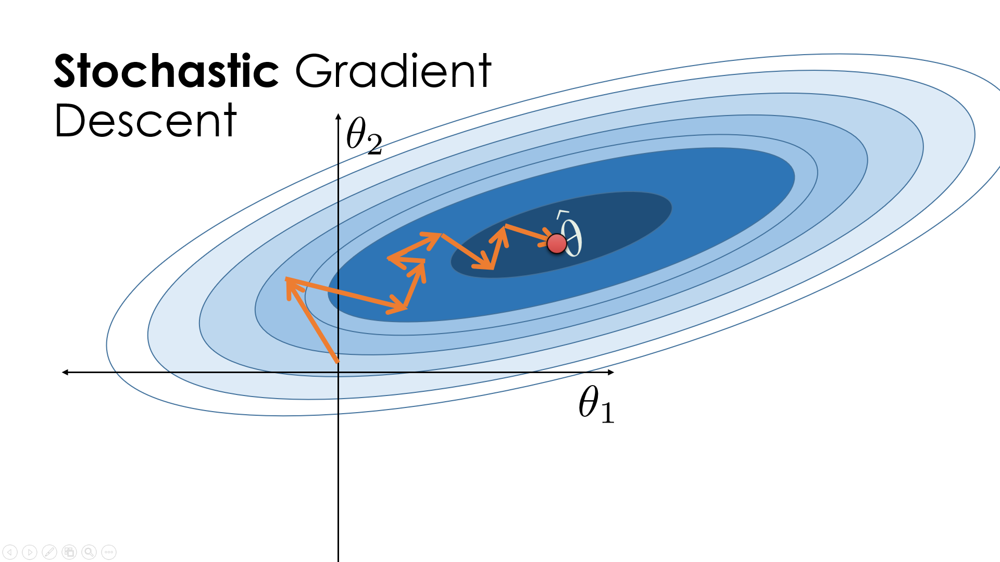

```python
# HIDDEN
import numpy as np
import matplotlib.pyplot as plt
import pandas as pd
import seaborn as sns
%matplotlib inline
import ipywidgets as widgets
from ipywidgets import interact, interactive, fixed, interact_manual
import nbinteract as nbi

sns.set()
sns.set_context('talk')
np.set_printoptions(threshold=20, precision=2, suppress=True)
pd.options.display.max_rows = 7
pd.options.display.max_columns = 8
pd.set_option('precision', 2)
```

# Limitations of Gradient Descent

In Chapter 11, we discussed gradient descent (also known as **batch gradient descent**), which is used to converge at the $\theta$ parameters that minimize a loss function $L(\theta, y)$.

$$
\theta_{t+1} = \theta_t - \alpha \cdot \nabla_\theta L(\theta, y)
$$

In logistic regression, we use the cross entropy cost as our loss function. Then we can replace  $\nabla_\theta L(\theta, y)$ with the gradient of the cross entropy cost to find the gradient descent algorithm specific to logistic regression. Letting $ \sigma_i = f_\hat{\theta}(X_i) = \sigma(X_i \cdot \hat \theta) $, this becomes:

$$
\theta_{t+1} = \theta_t - \alpha \cdot \left(- \frac{1}{n} \sum_{i=1}^{n} \left(y_i - \sigma_i\right) X_i \right)
$$

By definition, the gradient of the cross entropy cost is the average (taken over the entire batch of $n$ observations) of each observation's loss gradient, $-(y_i - \sigma_i)X_i$. This is then computed at each iteration $t$ of the gradient descent algorithm. For large $n$, this can become a computationally expensive problem to solve.

# Stochastic Gradient Descent

Our solution is **stochastic gradient descent**, a technique in which we approximate the true gradient of the cross entropy cost by using just one randomly chosen observation. Since the observation is chosen randomly, we expect that this observation's loss gradient is equal to the true gradient of the cross entropy cost. Our approximation of the gradient of the cross entropy cost is shown below, with $ \sigma_i = f_\hat{\theta}(X_i) = \sigma(X_i \cdot \hat \theta) $.

$$
\nabla_\theta L(\theta, y) \approx -(y_i - \sigma_i)X_i
$$

We can then plug this back into the general formula for gradient descent to find estimates for $\theta$:

$$
\begin{align}
\theta_{t+1} &= \theta_t - \alpha \cdot \nabla_\theta L(\theta, y) \\
&\approx \theta_t + \alpha \cdot (y_i - \sigma_i)X_i
\end{align}
$$

## Visualizing Stochastic Gradient Descent

Below are visual examples of loss minimization in batch gradient descent and stochastic gradient descent.




At each iteration of batch gradient descent, we move in the direction of the true gradient of the loss (shown by the ellipses). On the other hand, at each iteration of stochastic gradient, our steps may not lead us in the direction of the true gradient; however, our $\theta$ estimates eventually converge to the true loss-minimizing values. At large values of $n$, this is much more desirable due to the fast speed and low computational cost at which we can generate estimates at each iteration.

# Mini-batch Gradient Descent

We can improve our estimates by increasing the number of observations that we select at each iteration. In **mini-batch gradient descent**, we take a simple random sample (known as a mini-batch) of observations and use the average of their loss gradients to construct an estimate of the true gradient of the cross entropy cost. Since our sample is randomly selected, the expectation of this estimate is equal to the true gradient. This is illustrated in the approximation below, where $\mathcal{B}$ is the mini-batch of data points that we randomly sample from the $n$ observations.

$$
\nabla_\theta L(\theta, y) \approx -\frac{1}{|\mathcal{B}|} \sum_{i\in\mathcal{B}}(y_i - \sigma_i)X_i
$$

In order to select our mini-batch, we could randomly sample at each iteration. In practice, we randomly shuffle the training data and select our mini-batch by looping through the shuffled data. This also applies to stochastic gradient descent.


## Selecting the Mini-Batch Size

The mini-batch size is often set to small numbers such as 1 or 2 to minimize computational cost. However, when working with parallel machines such as a GPU or a distributed computing system, we can increase the mini-batch size to take advantage of the hardware. Since mini-batches can be computed in parallel, the runtime of larger mini-batches is roughly equivalent to the runtime of stochastic gradient descent.

# Summary

Batch gradient descent allows us to minimize the loss of the cost function at each iteration and take direct steps towards the loss-minimizing $\theta$ parameters. However, using the entire batch of $n$ observations can become computationally expensive for large $n$; in such scenarios, we use stochastic gradient descent or mini-batch gradient descent. While they may take noisier paths to the loss-minimizing $\theta$ parameters, they also reduce runtime by only computing the loss gradient over a small mini-batch of observations.

While we have made the distinction between stochastic and mini-batch gradient descent, stochastic gradient descent is sometimes used as an umbrella term that encompasses the selection of a mini-batch of any size. 
